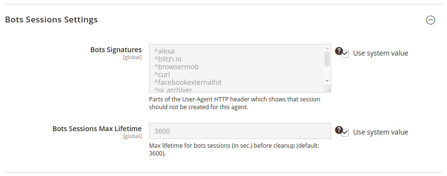

# Magento2: prevent session creation for search engines bots/crawlers and clean up expired sessions for humans

There is a [problem](https://magento.stackexchange.com/questions/18276/magento-generating-aprox-20-session-files-per-minute) with search engines bots and crawlers in Magento - new session is created for each request from the bots. So, there are a lot of "dead" sessions in sessions storage when any bot scans Magento pages - each page request creates a new session. This module [prevents](https://github.com/flancer32/mage2_ext_bot_sess/blob/master/Plugin/Session/SessionManager.php#L27) session creation for search engines bots and crawlers.

Another problem is that Magento does not clean up user's expired sessions if sessions are stored in DB. This module [does it](https://github.com/flancer32/mage2_ext_bot_sess/blob/master/Service/Clean.php#L125).

* [Configuration](#configuration)
* [Prevent the Sessions Creation](#prevent-the-sessions-creation)
* [Sessions Cleanup](#sessions-cleanup)
  * [DB Sessions](#db-sessions)
  * [Filesystem Sessions](#filesystem-sessions)
* [Logging](#logging)
* [User-Agents Analysis](#user-agents-analysis)
* [Install](#install)
* [Uninstall](#uninstall)


## Configuration

Go to `Stores / Configuration / General / Web / Bots Sessions Settings`:



* **Bots Signatures**: All parts will be concatenated into one regex "/^alexa|^blitz\.io|...|yandex/i" to lookup for the bots.
* **Bots Sessions Max Lifetime**: note, that Magento cron runs clean up job [every hour](./etc/crontab.xml).


## Prevent the Sessions Creation
This activity is independent of session storage (redis, db, files, ...) and available immediately after installation. Magento will not create new session if `User-Agent` HTTP header of the visitor will be filtered with `Bots Signatures` configuration option. 


## Sessions Cleanup
Users sessions can be [stored](https://devdocs.magento.com/guides/v2.3/config-guide/prod/config-reference-envphp.html#session) in [Redis](https://devdocs.magento.com/guides/v2.3/config-guide/redis/redis-session.html), in DB or as [files](https://devdocs.magento.com/guides/v2.3/config-guide/sessions.html).

This module cleans up only sessions saved in DB or filesystem.

### DB Sessions

Magento saves own sessions in DB (`./app/etc/env.php`):
```php
['session' => 
  [
    'save' => 'db',
  ]
];
```

Console command to clean up bot's existing sessions & user's expired sessions from DB:
```bash
$ ./bin/magento fl32:botsess:clean
```


### Filesystem Sessions

Magento saves own sessions in filesystem (`./app/etc/env.php`):
```php
['session' => 
  [
    'save' => 'files',
  ]
];
```

PHP garbage collector cleans up the sessions (see `session.gc_maxlifetime`). Magento in this mode cannot control sessions lifetime. Use this route to clean up files sessions for inactive users: `http://your.shop.com/fl32botsess/clean/files` and [this](./etc/bin/root_cron_clean_files.sh) template to create shell-script for cron.

**This is bad solution for bad practice. Don't use files for Magento sessions at all.**


## Logging
See logs for module's activities in `MAGENTO_ROOT/var/log/fl32.botsess.log`.


## User-Agents Analysis
If Magento saves sessions in DB then you can get list of user agents for active sessions after CLI cleanup:

```shell script
$ ./bin/magento fl32:botsess:clean
Command 'fl32:botsess:clean' is started.
1: Mozilla/5.0 (Linux; Android 8.1.0; DRA-LX5) AppleWebKit/537.36 (KHTML, like Gecko) Chrome/80.0.3987.149 Mobile Safari/537.36
...
1583: Mozilla/5.0 (iPhone; CPU iPhone OS 13_3_1 like Mac OS X) AppleWebKit/605.1.15 (KHTML, like Gecko) Version/13.0.5 Mobile/15E148 Safari/604.1
2439: Re-re Studio (+http://2re.site/)
9138: 1C+Enterprise/8.3
Total '50501' sessions are found in DB.
'0' sessions are not defined as bot's.
'0' sessions are deleted as bot's.
'170' sessions are deleted as inactive users.
'0' sessions have a failures during analyze.
'50331' sessions are belong to active users.
Command 'fl32:botsess:clean' is executed.
```

So, `2439: Re-re Studio (+http://2re.site/)` means that user agent named `Re-re Studio (+http://2re.site/)` was used in 2439 saved sessions. 


## Install
```bash
$ cd ${DIR_MAGE_ROOT}
$ composer require flancer32/mage2_ext_bot_sess
$ bin/magento module:enable Flancer32_BotSess
$ bin/magento setup:upgrade
$ bin/magento setup:di:compile
$ bin/magento setup:static-content:deploy
$ bin/magento cache:clean
$ # set filesystem permissions to your files
```


## Uninstall
You need an authentication keys for `https://repo.magento.com/` to uninstall any Magento 2 module. Go to your [Magento](https://marketplace.magento.com/customer/accessKeys/) account, section (My Profile / Marketplace / Access Keys) and generate pair of keys to connect to Magento 2 repository. Then place composer authentication file `auth.json` besides your `composer.json` as described [here](https://getcomposer.org/doc/articles/http-basic-authentication.md) and put your authentication keys for `https://repo.magento.com/` into the authentication file:
```json
{
  "http-basic": {
    "repo.magento.com": {
      "username": "...",
      "password": "..."
    }
  }
}
```

Then run these commands to completely uninstall `Flancer32_BotSess` module: 
```bash
$ cd ${DIR_MAGE_ROOT}   
$ bin/magento module:uninstall Flancer32_BotSess
$ composer remove flancer32/mage2_ext_bot_sess
$ bin/magento setup:upgrade
$ bin/magento setup:di:compile
$ bin/magento setup:static-content:deploy
$ bin/magento cache:clean
$ # set filesystem permissions to your files
```

Be patient, uninstall process (`bin/magento module:uninstall ...`) takes about 2-4 minutes. Remove `auth.json` file at the end:

 ```bash
$ rm ./auth.json
```
